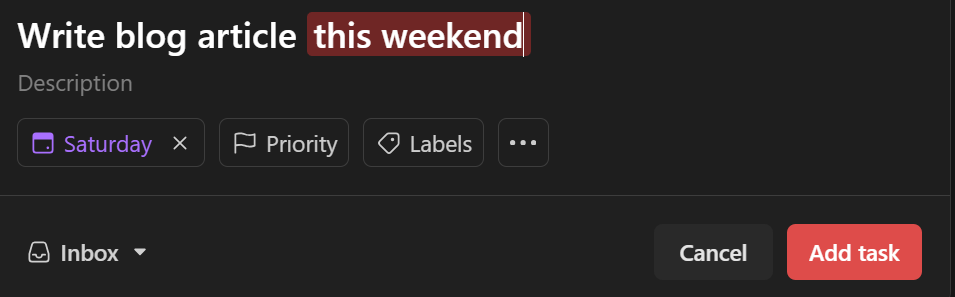

Todoist is my current task manager app, and I am following Carl Pullein's Time Sector System to create a workflow that better manages my to-do list. Carl’s system organizes tasks into time-based categories ("This Week," "Next Week," "This Month," etc.), allowing me to focus on when a task needs to be done, not just which project it belongs to. If you're interested in learning more about the system, here are some helpful links:

-   [A Revolutionary New Time Management System](https://www.carlpullein.com/blog/a-revolutionary-new-time-management-system-designed-for-the-21st-century/1/5/2020)

-   [Carl Pullein’s Todoist Template](https://todoist.com/templates/carl-pullein)

-   [Time Sector System YouTube Playlist](https://www.youtube.com/playlist?list=PLAzfmm1gS2_UKGuVs1sxlXHKMH-qLUunh)

While this approach has been helpful in prioritizing my workload, I found the manual process of moving tasks between time sectors during my weekly reviews a bit too time-consuming. To streamline my workflow, I made a few adjustments, integrating Todoist’s built-in features like Filters and Due Dates to automate parts of the process.

### Switching from Projects to Filters

Carl’s system suggests using the “My Projects” section for time sectors and “Labels” for work areas. However, I found that constantly shifting tasks between "This Week" and "Next Week" was too manual. About two weeks ago, I decided to switch from using Projects to Filters. Todoist’s due dates are well-suited for this, as they can manage the timing automatically. Since making this change, my daily and weekly reviews have become much quicker.

I also transitioned from using Labels to Projects for organizing work areas. Dragging and dropping tasks into Projects is much easier than manually applying labels. After reading several comments on the Todoist subreddit, I found many others also prefer using Projects while following Carl’s Time Sector System. While Carl recommends managing projects in a separate app (like a notes app), which I also do for more detailed project information, having tasks under Projects in Todoist provides helpful context during day-to-day work.

### My Setup Details

I rely on due date shortcuts and natural language processing (NLP) for due dates, which eliminates the need to manually pick dates from the calendar.

This Week – This Weekend (Saturday)
Next Week – Next Week (Next Monday)
This Month – Last Day (Last day of current month)
Next Month – First Day (First day of next month)
Someday – No Date

#### Here’s how I set up my filters:

-   **This Week**: `due before: next week & !recurring`

-   **Next Week**: `(due: next week | due after: next week) & due before: 1 week after next week & !recurring`

-   **This Month**: `(due before: first day & !due before: 7 days after next week) & !recurring`

-   **Next Month**: `due after: last day & due before: +31 days after last day & !recurring`

-   **Someday**: `no due date & !subtask & !recurring & !#Inbox`

-   **Recurring / Routines**: `recurring`

Using these filters, Todoist automatically moves tasks based on their due dates (e.g., tasks due “Next Week” shift to “This Week” every Monday). This setup keeps my tasks organized without constant reordering.

### Daily, Weekly, and Monthly Reviews

I’ve stuck to Carl Pullein’s daily, weekly, and monthly review structure. Instead of scheduling the entire week in advance, I plan each day in the morning, pulling tasks from the "This Week" filter. During the day, I only work in the "Today" section, avoiding other filters to stay focused and flexible.

### Limitations

I posted about my experiment on the Todoist subreddit and received mostly positive feedback. However, one limitation is distinguishing tasks with actual due dates from those assigned to time sectors. For example, I use "Next Saturday," "Next Monday," "Last Day of the Month," and "First Day of Next Month" to group tasks, but if a task is genuinely due on one of these dates, it requires some mental effort to differentiate. Many Todoist users use square brackets \[ \] in task titles to indicate real due dates, and I’ve adopted this workaround. Most of my day-to-day tasks aren’t deadline-driven, so this hasn't been a major issue for me. Hopefully, Todoist’s upcoming **Deadlines** feature will simplify this further.

### Exploring Time Blocking

I’ve also begun experimenting with Time Blocking, but Todoist’s features aren’t well-suited for it yet. Scheduling time for every task became too exhausting, so I hope Todoist introduces something similar to Akiflow’s Time Slots. For now, I’ve started integrating Google Calendar with Todoist to handle time blocking, and I plan to share my results in the future.

### The Future of My Workflow

Since I’ve only been using this system for a short while, I’m still refining it. I’m also looking forward to Todoist’s upcoming Deadlines feature, which should enhance my workflow.

Carl Pullein’s system is both simple and effective, but I wanted to make it more automated by leveraging Todoist’s features. If you’ve also been experimenting with Carl’s Time Sector System, I’d love to hear about your changes and how they’re working for you. Feel free to share your experiences in the comments!
