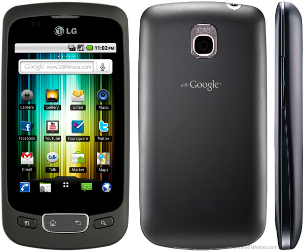

It was around six months back when I purchased my first Android phone LG Optimus One after in love with Nokia for 4.5 years.  This was a pretty happy transition due to availability of lot of useful applications available for Android in comparison of Symbian, the underlying operating system of Nokia phones. There is a huge difference in applications available on Android Market and Nokia Ovi Store in terms of both Quantity and Quality.

Based upon 6 months of experience with Android I would like to list some useful applications along with their download link and small description. All applications mentioned are free. Here I go with first 5.

1.  **Gmail** –
    [https://market.android.com/details?id=com.google.android.gm](https://market.android.com/details?id=com.google.android.gm)
    This is install by default on all Android phones and as name implies this is wonderful applications for accessing Gmail for both individual and Google Apps account.
2.  **Adobe Reader** –
    [https://market.android.com/details?id=com.adobe.reader](https://market.android.com/details?id=com.adobe.reader)
    For reading PDF files
3.  **App 2 SD** –
    [https://market.android.com/details?id=com.a0soft.gphone.app2sd](https://market.android.com/details?id=com.a0soft.gphone.app2sd)
    After download and installation of any application App 2 SD automatically alerts in the application can be moved to SD Card to save internal memory.
4.  **SMS Popup** –
    [https://market.android.com/details?id=net.everythingandroid.smspopup](https://market.android.com/details?id=net.everythingandroid.smspopup)
    After receiving a SMS this applications shows a pop up window on mobile screen with complete content. There is no need to go to Messaging application for reading the SMS.
5.  **Google Docs** –
    [https://market.android.com/details?id=com.google.android.apps.docs](https://market.android.com/details?id=com.google.android.apps.docs)
    For accessing Google Docs files on mobile

I will list more applications in future posts.
